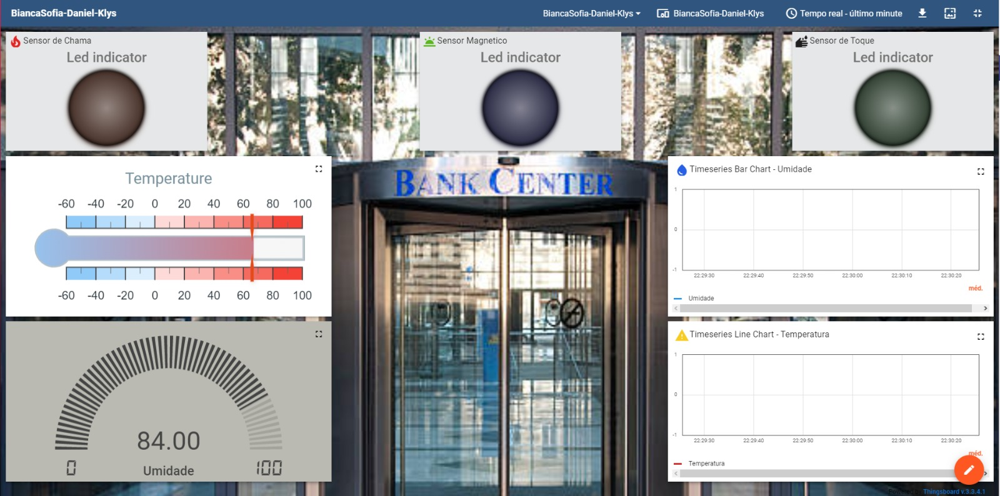

[](https://classroom.github.com/online_ide?assignment_repo_id=11474139&assignment_repo_type=AssignmentRepo)

# Fundamentos de Sistemas Embarcados (FSE)
## [Trabalho Final - 2023/1]
</br>

No contexto do trabalho, há uma porta de um banco equipada com diversos sensores de monitoramento, que são:

### Sensores 
* Sensor de toque
* Detector de chama
* Sensor de efeito hall magnético
* LED RGB
* Buzzer ativo / passivo
* Sensor de temperatura
  
Esses sensores desempenham funções específicas para garantir a segurança e controle de acesso à porta. O buzzer permanece ativo quando a porta é aberta e é desligado automaticamente quando o sensor magnético detecta que a porta foi fechada.

Essa configuração permite que o sistema de monitoramento detecte qualquer tentativa de abertura não autorizada da porta, ativando o buzzer para alertar os responsáveis pela segurança. Além disso, o LED RGB pode ser usado para sinalizar diferentes estados da porta, como vermelho para indicar uma tentativa de acesso não autorizado e verde para confirmar que a porta está fechada corretamente.

O sensor de toque e o detector de chama adicionam camadas adicionais de segurança, possibilitando a detecção de toques indesejados ou qualquer situação de risco de incêndio próximo à porta.

O sensor de temperatura e umidade pode ser utilizado para monitorar a temperatura ambiente próxima à porta, permitindo que medidas preventivas sejam tomadas caso haja variações fora dos limites aceitáveis.

## Alunos

| Nome | Matrícula  |
| :- | :- |
| Bianca Sofia Brasil | 190025298 |
| Daniel Vinicius Ribeiro Alves  | 190026375 |
| Klyssmann Henrique de Oliveira| 202028202 |


# Dashboard




## Como rodar

* Clonar o repositório
```
$ git clone https://github.com/FGA-FSE/trabalho-final-2023-1-biancasofiadanielklyssmann.git
```

* Configurar a conexão Wifi.
```
$ pio run -t menuconfig
``` 

* Realizar o build do projeto e executar o upload.

* Verificar mudanças no Dash
